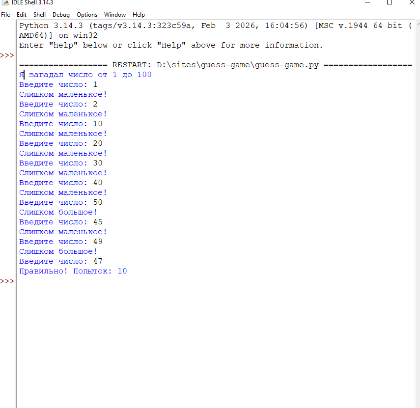

# Игра "Угадай число"

## Описание
Консольная игра на Python, в которой пользователь должен угадать случайное число от 1 до 100.  
Программа сообщает, больше или меньше загаданное число, и подсчитывает количество попыток.

## Технологии
- Python
- random
- Условия и циклы

## Функционал
- Генерация случайного числа
- Подсчёт попыток пользователя
- Проверка корректности ввода

## Скриншоты


## Демо


## Как запустить
1. Клонируйте репозиторий:  
```bash
git clone https://github.com/KsenjaVassiljeva/guess-game.git
